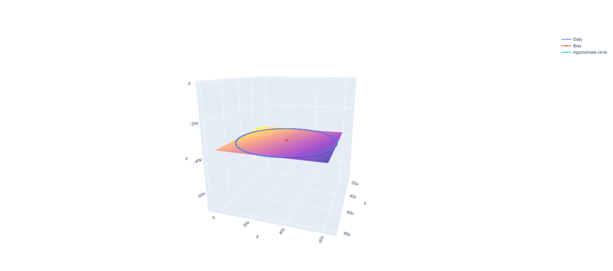

# IMU calibration

The ROS package can calibrate a IMU sensor.

## Magnetic calibration

Bias correction is required when measuring geomagnetic field with magnetic sensors.
In magnetic calibration, the robot is rotated and the bias is estimated from the magnetic field data.

In this calibration, the following minimization problem is solved under the assumption that the collected magnetic field data form a circle on the same plane.

$$ \text{Minimize}: \sum_i ((x_i-b_1)^2 + (y_i-b_2)^2 + (z_i-b_3)^2 - r^2)^2 + (a_1(x_i-b_1) + a_2(y_i-b_2)+a_3(z_i-b_3))^2 $$

where $x_i,y_i,z_i$ is the measurement data, $r$ is the radius of the circle, $\vec{a}$ is the normal vector of the plane and $\vec{b}$ is the bias.

### Parameters

- `duration`: Duration of correction sensor data (default: `60.0[s]`)
- `velocity`: Angular velocity of rotation (default: `0.2[rad/s]`)
- `output_file`: Output file name (default: `"path/to/imu_calibration/config/mag.yaml"`)
- `visualize`: Visualize the calibration result (default: `false`)

### Inputs

- `mag` ([sensor_msgs/MagneticField](http://docs.ros.org/api/sensor_msgs/html/msg/MagneticField.html))  
    Sensor value of the magnetic field to be calibrated

### Outputs

- `cmd_vel` ([geometry_msgs/Twist](http://docs.ros.org/api/geometry_msgs/html/msg/Twist.html))  
    Command to rotate the robot

### Example

```bash
roslaunch imu_calibration magnetic_calibration.launch
```

Please remap topics if necessary.
If `visualize==true`, you will get the result shown in the figure below after the calibration is completed.



The results output to log and output_file can be used as correction parameters for the IMU driver node or for [imu_filter_madgwick](http://wiki.ros.org/imu_filter_madgwick).
